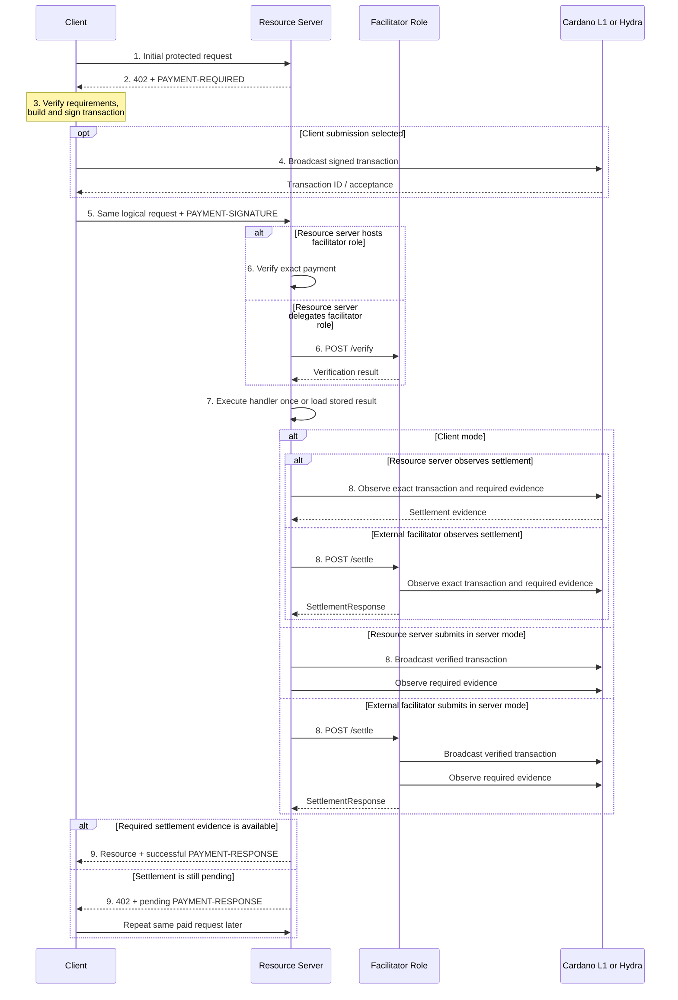
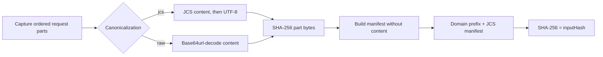
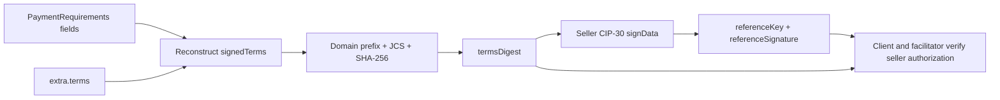
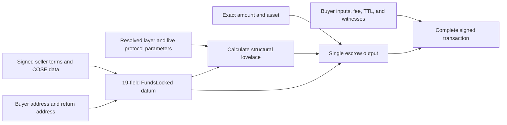
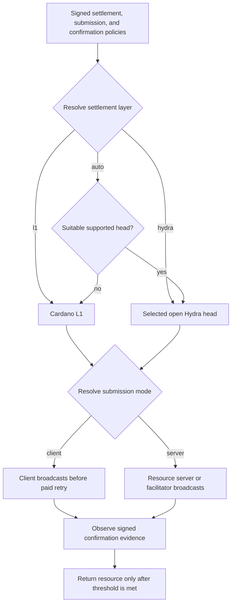

# Scheme: exact on Cardano

## Summary

> **TL;DR:** The client builds and signs one Cardano transaction. The transfer method defines whether it pays an address, Masumi V2, or another script.

This document defines the x402 `exact` payment scheme for Cardano native assets. It supports three transfer methods:

1. `default` sends funds to a Cardano address.
2. `masumi` locks funds in the Masumi V2 `vested_pay` contract.
3. `script` locks funds in a server-defined contract.

The `masumi` method has a fixed 19-field datum and a defined escrow lifecycle. x402 validates the initial `FundsLocked` output. Later contract transitions remain outside this scheme.

The `script` method accepts an arbitrary contract and datum. x402 validates the script address but cannot validate contract-specific datum rules.

`assetTransferMethod` belongs in `PaymentRequirements.extra` because it changes the payment transaction. It is not an optional x402 extension. If a client ignores `masumi`, it can create an unusable escrow output without the required datum.

## Network Identifiers

The scheme advertises `cardano:mainnet`, `cardano:preprod`, or `cardano:preview` in `/supported`.

The `cardano` namespace follows CAIP-2 syntax. CASA does not register this namespace. [CIP-34](https://cips.cardano.org/cip/CIP-0034) defines the `cip34:NetworkId-NetworkMagic` format.

This scheme recognizes these aliases:

- `cip34:1-764824073` for mainnet
- `cip34:0-1` for preprod
- `cip34:0-2` for preview

Clients and facilitators SHOULD accept these three CIP-34 values as aliases. They normalize each alias to its matching `cardano:*` value. No other aliases are valid.

## Protocol Flow

> **TL;DR:** The server returns one complete 402 response. The client builds and signs the transaction, then repeats the request with payment proof.



The client controls the payment flow:

1. The client sends the initial protected-resource request.
2. The resource server returns a complete 402 response with one or more `PaymentRequirements`.
3. The client verifies the selected requirements, constructs the complete transaction, and signs it.
4. The client MAY submit the transaction when the selected method permits client submission.
5. The client repeats the same request with the `PAYMENT-SIGNATURE` header. This is not another quote or start call. The client can repeat the same paid request idempotently while settlement is pending; it does not send another unpaid request.
6. The resource server verifies the payment locally or calls `/verify`. An external facilitator is optional.
7. The protected handler executes once and its result is stored, or an identical retry loads the stored result.
8. Settlement submits or observes the exact transaction. `/settle` MUST verify it again.
9. Successful settlement allows the resource server to return the stored resource and a successful `PAYMENT-RESPONSE`. While settlement is pending, the server returns 402 with the pending response defined below. The client can repeat the exact paid request; it does not create or sign another transaction.

Cardano L1 has probabilistic finality. Mempool settlement has rollback, conflict, and drop risks. Each payment method defines the required settlement evidence.

### `PaymentRequired`

#### Default Schema

For HTTP, the resource server returns status 402 with a base64-encoded `PaymentRequired` object in the `PAYMENT-REQUIRED` header. The decoded object has this structure:

```js
{
  "x402Version": 2,
  "error": "PAYMENT-SIGNATURE header is required",
  "resource": {
    "url": "https://api.example.com/premium-data",
    "description": "Access to premium market data",
    "mimeType": "application/json"
  },
  "accepts": [
    {
      "scheme": "exact",
      "network": "cardano:mainnet", // testnets: cardano:preprod or cardano:preview
      "amount": "10000",
      "asset": "c48cbb3d5e57ed56e276bc45f99ab39abe94e6cd7ac39fb402da47ad.0014df105553444d",
      "payTo": "addr1...",
      "maxTimeoutSeconds": 600,
      "extra": {
        "submissionPolicy": "either"
      }
    }
  ]
}
```

For a native asset, use `policyId.assetNameHex`. `policyId` is exactly 56 lowercase hexadecimal characters. `assetNameHex` has 0 through 64 lowercase hexadecimal characters. Its length MUST be even.

The example uses mainnet USDM. Its preprod policy ID is `e675b46e4d2242c991a8932a99db3044e80515ae14b4c4ccf6b3f4c9`.

#### Submission policy

All three transfer methods support resource-server, facilitator, or client submission. The 402 response selects the permitted submitter:

- For `default` and `script`, `PaymentRequirements.extra.submissionPolicy` is `server`, `client`, or `either`. If absent, it defaults to `server`.
- For `masumi`, signed `extra.terms.submissionPolicy` contains the same values. The Masumi section below defines its signature and policy checks.

`server` means that the resource server or an external facilitator submits the signed transaction. `client` means that the client submits it before the paid request. `either` lets the client select one of those modes.

The paid payload MAY contain `submissionMode: "server"` or `submissionMode: "client"`. If it is absent, implementations normalize it to `server`, which preserves the existing x402 submission flow. The normalized mode MUST match the requirements policy. An omitted mode therefore cannot satisfy a client-only policy. `either` is never a payload mode. A retry for the same transaction MUST use the same normalized mode.

`/supported` MAY advertise `submissionModes` as capabilities. The selected policy always comes from the 402 requirements; the client MUST NOT infer it from `/supported`.

#### `masumi` transfer method

> **TL;DR:** The 402 response contains all seller terms. The buyer builds one Masumi V2 lock for one asset and sends it on the signed retry.

This method supports Masumi V2 only. The buyer locks one requested asset in the deployed V2 `vested_pay` contract. x402 covers only the initial `FundsLocked` output. Later Masumi state transitions are outside this scheme.

The initial request replaces `/start_job` only in the x402 flow. Native MIP-003 agents can continue to use `/start_job`. A resource server can use Masumi Payment Service, another SDK, or its own implementation.

In this section, the **requirements issuer** creates the Masumi `PaymentRequirements` and gets the seller authorization. The resource server or a service can fill this role.

The requirements contain one top-level `amount` and one `asset`. This method does not support a Masumi multi-fund payment.

`amount` MUST be a positive canonical decimal string. `asset` MUST be `lovelace` or the canonical `policyId.assetNameHex` form above.

```json
{
  "x402Version": 2,
  "resource": {
    "url": "https://agent.example/weather",
    "mimeType": "application/json"
  },
  "accepts": [
    {
      "scheme": "exact",
      "network": "cardano:preprod",
      "amount": "5000000",
      "asset": "lovelace",
      "payTo": "addr_test1wzs4e6wc95hkwezlccjw9mdvq0r0rsgx6zk34avptga3ftgn37w4g",
      "maxTimeoutSeconds": 600,
      "extra": {
        "assetTransferMethod": "masumi",
        "inputCommitment": {
          "version": "1",
          "algorithm": "sha256",
          "parts": [
            {
              "name": "body",
              "canonicalization": "jcs",
              "mediaType": "application/json",
              "content": { "days": 3, "units": "metric" },
              "digest": "e33986d62ef871de151b8258eb9624fbfa220b6f9a4fe170bf168dfa2c957440"
            },
            {
              "name": "raw",
              "canonicalization": "raw",
              "mediaType": "application/json",
              "content": "eyJ1bml0cyI6Im1ldHJpYyIsImRheXMiOjN9",
              "digest": "7341dc0b5fb9880c6d3b57387e2d83c4fb4d8b899b7371fca1d1361774a08836"
            }
          ],
          "digest": "c0e9ea5b7fd6bc1ae5d06c32ca6e492d5ae1eb6f0baa683df302b67594ff69c7"
        },
        "terms": {
          "version": "1",
          "paymentType": "Web3CardanoV2",
          "sellerAddress": "addr_test1q...",
          "sellerReturnAddress": "addr_test1q...",
          "sellerNonce": "<32-byte lowercase hex>",
          "buyerNonce": "",
          "agentIdentifier": "<optional registered-agent asset id lowercase hex>",
          "inputHash": "c0e9ea5b7fd6bc1ae5d06c32ca6e492d5ae1eb6f0baa683df302b67594ff69c7",
          "payByTime": "1785756000000",
          "submitResultTime": "1785759600000",
          "unlockTime": "1785763200000",
          "externalDisputeUnlockTime": "1785766800000",
          "settlementPolicy": "auto",
          "submissionPolicy": "server",
          "confirmationPolicy": { "l1Confirmations": 1 }
        },
        "referenceKey": "<complete CBOR COSE_Key lowercase hex>",
        "referenceSignature": "<complete CBOR COSE_Sign1 lowercase hex>",
        "blockchainIdentifier": "<Masumi compatibility identifier lowercase hex>"
      }
    }
  ]
}
```

`extra`, optional `deployment`, `inputCommitment`, every commitment part, `terms`, and `confirmationPolicy` are closed objects. Unknown fields are invalid.

The following wire constraints apply:

| Field | Constraint |
|---|---|
| `assetTransferMethod` | literal `masumi` |
| `deployment.requiredAdmins` | positive canonical base-10 integer string, no greater than the length of `adminVkeys` |
| `deployment.adminVkeys` | ordered non-empty array of 28-byte lowercase hex verification-key hashes. Duplicates are preserved and represent voting weight |
| `deployment.cooldownPeriod` | non-negative canonical base-10 POSIX-millisecond integer string |
| `inputCommitment.version` | literal string `1` |
| `inputCommitment.algorithm` | literal `sha256` |
| `inputCommitment.parts` | non-empty ordered array with unique non-empty `name` values |
| part `canonicalization` | `jcs` or `raw` |
| part `mediaType` | optional non-empty string, preserved byte-for-byte |
| part `content` | any RFC 8785-compatible JSON value for `jcs`, or an unpadded base64url string for `raw` |
| part `digest`, `inputCommitment.digest` | exactly 32 bytes as 64 lowercase hexadecimal characters |
| `referenceKey` | lowercase even-length hex encoding of one complete CBOR `COSE_Key` |
| `referenceSignature` | lowercase even-length hex encoding of one complete CBOR `COSE_Sign1` |
| `blockchainIdentifier` | lowercase even-length hex encoding of the complete LZString-compressed compatibility identifier |

`terms` has these fields:

| Field | Constraint |
|---|---|
| `version` | literal string `1` |
| `paymentType` | literal `Web3CardanoV2` |
| `sellerAddress` | key-credential Cardano address on selected network |
| `sellerReturnAddress` | optional key-credential Cardano address on the selected network, omitted when absent |
| `sellerNonce` | exactly 32 fresh cryptographically random bytes as 64 lowercase hex characters |
| `buyerNonce` | empty string, or 7–13 bytes as 14–26 even-count lowercase hex characters |
| `agentIdentifier` | optional `null`, empty string, or non-empty even-length lowercase hex registry asset identifier |
| `inputHash` | exactly equal to `inputCommitment.digest` |
| four `*Time` fields | positive canonical base-10 POSIX-millisecond strings with no leading zero. The V2 minimum intervals below apply |
| `settlementPolicy` | `auto`, `l1`, or `hydra` |
| `submissionPolicy` | `server`, `client`, or `either` |
| `confirmationPolicy.l1Confirmations` | JSON integer from `-1` through `20` |

`sellerReturnAddress` is optional. The requirements issuer MUST omit it when absent; JSON `null` is invalid.

`agentIdentifier` can be omitted, `null`, or an empty string for an unregistered seller. A non-empty value selects registered-agent verification. The requirements issuer SHOULD omit the field for an unregistered seller, but clients and facilitators MUST accept all three unregistered forms.

`deployment` is optional on mainnet and preprod. If omitted, it selects the canonical Masumi V2 deployment for that network.

Use `deployment` for another parameter set of the same approved V2 implementation. Preview requires it because preview has no canonical default.

```json
{
  "requiredAdmins": "2",
  "adminVkeys": ["<ordered weighted 28-byte key hashes; duplicates allowed>"],
  "cooldownPeriod": "420000"
}
```

The requirements issuer MUST generate a fresh `sellerNonce` for every new requirements object. It MUST use a cryptographically secure random generator.

It MUST NOT reuse a nonce for a later initial request. A paid retry reuses the complete requirements object and its nonce.

The buyer MAY omit a nonce from the initial protected-resource request. A resource API MAY define one source for the nonce. This source can be a body field, parameter, or application header.

The seller-signed 402 terms always contain `buyerNonce`. Its value MAY be empty.

The requirements issuer copies and signs the value. An absent source becomes empty bytes.

The resource server extracts the value again on the paid retry. It MUST match the signed value. No component can add or replace the nonce after the 402 response.

##### Request commitment

> **TL;DR:** The server returns the exact content that it commits to. The client checks every digest and approves the content in its application context.

`inputCommitment.parts` is an ordered array with unique names. Conventional names are `parameters`, `body`, and `raw`, but applications MAY define other names. Every part has:

- `name`: a unique string
- `canonicalization`: `jcs` or `raw`
- optional `mediaType`, preserved exactly
- `content`: a JSON value for `jcs`, or unpadded base64url bytes for `raw`
- `digest`: lowercase hex `SHA-256(partBytes)`.

For `jcs`, `partBytes = UTF-8(RFC8785-JCS(content))`. For `raw`, `partBytes = base64url-decode(content)`.

A raw part MUST identify a stable capture point before a parser changes the bytes. For HTTP, `raw` normally contains the entity body at that point. It does not contain the full HTTP message.

The server MUST exclude x402 headers and variable transport headers. A proxy or decoder can change bytes before the capture point. In that case, the server returns the changed bytes that it committed to.

To make the manifest, omit each part's `content` property and the top-level `digest` property. Do not set these properties to `null` or an empty value. Keep all other fields and the part order. Then calculate:

```text
inputHash = SHA-256(
  UTF-8("masumi:x402:input:v1\n") ||
  UTF-8(JCS(manifest))
)
```

For the complete two-part requirements example above, JCS produces this manifest:

```json
{"algorithm":"sha256","parts":[{"canonicalization":"jcs","digest":"e33986d62ef871de151b8258eb9624fbfa220b6f9a4fe170bf168dfa2c957440","mediaType":"application/json","name":"body"},{"canonicalization":"raw","digest":"7341dc0b5fb9880c6d3b57387e2d83c4fb4d8b899b7371fca1d1361774a08836","mediaType":"application/json","name":"raw"}],"version":"1"}
```

The resulting `inputHash` is `c0e9ea5b7fd6bc1ae5d06c32ca6e492d5ae1eb6f0baa683df302b67594ff69c7`.



The client MUST recompute every part digest and `inputHash`. The application SHOULD compare known content with the intended request.

The application MUST show unknown content to the user for approval. The facilitator checks the digests but cannot check their application meaning.

The resource server rebuilds the commitment from the signed retry. It rejects a mismatch.

For HTTP, the base64 `PAYMENT-REQUIRED` header contains all returned content. This scheme sets no fixed content or header-size limit. The resource server MUST check the final header against its actual transport limit.

The server MUST NOT truncate content or replace it with a URL. It SHOULD return an application error such as HTTP 413 when the complete header does not fit.

Servers SHOULD keep `raw` parts small. Raw bytes use base64url inside JSON. HTTP then applies base64 to the JSON.

Servers MUST NOT capture secrets, cookies, authorization headers, x402 headers, or the complete HTTP request. They MUST NOT log payment headers or committed content.

##### Seller-signed terms

> **TL;DR:** The seller signs one digest that covers the price, asset, contract, request hash, identity, deadlines, and settlement rules.

`extra.terms` is a closed object and MUST NOT repeat projected top-level fields. Client and facilitator validate the default or optional custom deployment as described below, then reconstruct:

```text
signedTerms = {
  ...terms,
  scheme: PaymentRequirements.scheme,
  assetTransferMethod: extra.assetTransferMethod,
  network: PaymentRequirements.network,
  contractAddress: PaymentRequirements.payTo,
  amount: PaymentRequirements.amount,
  asset: PaymentRequirements.asset,
  maxTimeoutSeconds: PaymentRequirements.maxTimeoutSeconds
}

termsDigest = SHA-256(
  UTF-8("masumi:x402:terms:v1\n") ||
  UTF-8(JCS(signedTerms))
)
```



The seller calls [CIP-30](https://cips.cardano.org/cip/CIP-0030) `signData(sellerAddress, lowercaseHex(termsDigest))`. The returned `DataSignature` follows [CIP-8](https://cips.cardano.org/cip/CIP-0008).

`referenceKey` contains the complete CBOR `COSE_Key` as lowercase hex. `referenceSignature` contains the complete CBOR `COSE_Sign1` as lowercase hex.

The attached payload is the 32-byte `termsDigest`. Set `hashed` to `false`. Use empty external AAD.

Client and facilitator MUST decode and verify both COSE objects. They MUST check:

- `kty = OKP (1)`, `alg = EdDSA (-8)`, and `crv = Ed25519 (6)`
- a 32-byte public key with no private material
- protected `COSE_Sign1` headers containing `alg = EdDSA (-8)` and the raw `sellerAddress`
- an unprotected `hashed = false` header and empty external AAD
- an attached payload equal to `termsDigest`
- a valid Ed25519 `Sig_structure`
- equal `kid` values when they are present
- `Blake2b-224(publicKey)` equal to the seller payment-key credential

A seller address with a script payment credential is invalid.

##### Identity and compatibility identifier

> **TL;DR:** A non-empty signed `agentIdentifier` makes a registry claim. An omitted, `null`, or empty value means that the seller is unregistered.

When `agentIdentifier` is a non-empty string, the client and facilitator MUST validate the V2 registry claim independently. This check covers the asset, seller authorization, metadata, endpoint, network, and price.

Fixed and dynamic prices MUST resolve to the signed top-level amount and asset. The issuer MUST reject a registered price that requires multiple assets. It MUST NOT select only one asset.

When `agentIdentifier` is absent, `null`, or an empty string, datum `agent_identifier` contains empty bytes. No component can claim registry identity or reputation.

The client and facilitator reconstruct `signedTerms` with the exact wire value. They MUST NOT omit, insert, or replace `agentIdentifier` before calculating `termsDigest`. Treating the three forms as the same identity mode does not make their signatures interchangeable.

```text
agentIdentifierHex = terms.agentIdentifier if it is a non-empty string, otherwise ""
sellerIdentifierHex = sellerNonceHex + agentIdentifierHex

identifierText =
  sellerIdentifierHex + "." +
  buyerNonceHex + "." +
  referenceSignatureHex + "." +
  referenceKeyHex + "." +
  contractAddressBech32

blockchainIdentifier = hex(
  LZString.compressToUint8Array(identifierText)
)
```

`identifierText` is UTF-8 text. Its characters are in the ASCII range. Implementations MUST join the encoded text values before compression. They MUST NOT hex-decode the first four segments before they join them.

The first four segments contain lowercase hexadecimal text. The final segment contains the Bech32 contract address.

The decompressed value has five period-delimited text segments. The first 64 characters of the first segment encode the 32-byte `sellerNonce`. Any remaining characters encode `agentIdentifier`.

The second segment MAY be empty for this method. Implementations MUST preserve the empty segment. Native Masumi APIs can still require a buyer nonce.

The following encoding-only vectors test the compatibility codec. The short key and signature values are not valid COSE objects.

**Unregistered seller with an empty buyer nonce**

| Field | Value |
|---|---|
| `sellerNonceHex` | `11` repeated 32 bytes |
| `agentIdentifierHex` | empty |
| `buyerNonceHex` | empty |
| `referenceSignatureHex` | `55` repeated 16 bytes |
| `referenceKeyHex` | `a10101` |
| `contractAddressBech32` | `addr_test1wzs4e6wc95hkwezlccjw9mdvq0r0rsgx6zk34avptga3ftgn37w4g` |

The exact `identifierText` is:

```text
1111111111111111111111111111111111111111111111111111111111111111..55555555555555555555555555555555.a10101.addr_test1wzs4e6wc95hkwezlccjw9mdvq0r0rsgx6zk34avptga3ftgn37w4g
```

The exact `blockchainIdentifier` is:

```text
230d7c6574f41d1c0acc96ade8eae04360019f607004d8809c07d005c053019cae007700bce8058680d89818c04e44002c035931a2c00daf5e00ac9bf00b6c401b80473c6535d00e6003cb8b110199db615001ca8eecc6019b58076c603b13763a80
```

**Registered seller**

| Field | Value |
|---|---|
| `sellerNonceHex` | `22` repeated 32 bytes |
| `agentIdentifierHex` | `aa` repeated 28 bytes, followed by `01` |
| `buyerNonceHex` | `01020304050607` |
| `referenceSignatureHex` | `66` repeated 16 bytes |
| `referenceKeyHex` | `a10102` |
| `contractAddressBech32` | `addr_test1wzs4e6wc95hkwezlccjw9mdvq0r0rsgx6zk34avptga3ftgn37w4g` |

The exact `identifierText` is:

```text
2222222222222222222222222222222222222222222222222222222222222222aaaaaaaaaaaaaaaaaaaaaaaaaaaaaaaaaaaaaaaaaaaaaaaaaaaaaaaa01.01020304050607.66666666666666666666666666666666.a10102.addr_test1wzs4e6wc95hkwezlccjw9mdvq0r0rsgx6zk34avptga3ftgn37w4g
```

The exact `blockchainIdentifier` is:

```text
130d7c6574f4218314e4b56f46e00602300e972d82c0662c0162c0562c0362c0763d6975b7d8f3b6f3874381e004d0402700fa005c0298067093803b802f19e4a6d05018c02715001601ac154a5006d36680560bb405b4100dc0239611ae64073001eb494192e4700e000e121e70240066610076240c0ae41e400000
```

For each vector, decompression MUST return the exact `identifierText`, including all period delimiters.

The server returns the complete identifier. The client does not construct it for transport. The client and facilitator reconstruct it and require:

```text
PaymentRequirements.payTo
  == signedTerms.contractAddress
  == decode(blockchainIdentifier).smartContractAddress
  == transaction escrow output address
```

##### Escrow datum and client-built collateral

> **TL;DR:** The wallet builds the 19-field datum and computes structural lovelace from the final transaction. The seller does not provide collateral.

The client constructs the escrow **datum**. It attaches the datum inline to the output at `payTo`.

The canonical CIP-57 blueprint below defines the normative `vested_pay/Datum` schema and its referenced types. The scheme-level schema version is `masumi.vested_pay.v2`.

The outer datum is Plutus Data `Constr 0` with these 19 ordered fields:

| # | Datum field | Value at lock | Source |
|---|-------------|---------------|--------|
| 0 | `buyer` | key address whose payment credential controls the `payload.nonce` input | client wallet |
| 1 | `buyer_return_address` | `None`, or buyer key address | client wallet |
| 2 | `seller` | seller key address | signed terms |
| 3 | `seller_return_address` | `None`, or seller key address | signed terms |
| 4 | `reference_key` | bytes | `extra.referenceKey` |
| 5 | `reference_signature` | bytes | `extra.referenceSignature` |
| 6 | `seller_nonce` | bytes | signed terms |
| 7 | `buyer_nonce` | bytes, possibly empty | signed terms |
| 8 | `agent_identifier` | bytes, possibly empty | signed terms |
| 9 | `collateral_return_lovelace` | integer ≥ 0 | client calculation |
| 10 | `input_hash` | 32 bytes | signed terms / commitment |
| 11 | `result_hash` | **empty** | — |
| 12 | `pay_by_time` | POSIX ms | signed terms |
| 13 | `submit_result_time` | POSIX ms | signed terms |
| 14 | `unlock_time` | POSIX ms | signed terms |
| 15 | `external_dispute_unlock_time` | POSIX ms | signed terms |
| 16 | `seller_cooldown_time` | `0` | — |
| 17 | `buyer_cooldown_time` | `0` | — |
| 18 | `state` | `FundsLocked` | — |

The referenced CIP-57 types encode as follows. Implementations MUST build this Plutus Data structure. They MUST NOT encode a Cardano address as Bech32 text or raw address bytes.

| Type | Plutus Data encoding |
|---|---|
| `Address` | `Constr 0 [paymentCredential, stakeCredentialOption]` |
| payment or stake `VerificationKey` credential | `Constr 0 [Bytes(28-byte key hash)]` |
| payment or stake `Script` credential | `Constr 1 [Bytes(28-byte script hash)]` |
| `Option<Address>.Some(address)` | `Constr 0 [address]` |
| `Option<Address>.None` | `Constr 1 []` |
| stake credential option `Some(Inline(credential))` | `Constr 0 [Constr 0 [credential]]` |
| stake credential option `Some(Pointer(slot, txIndex, certIndex))` | `Constr 0 [Constr 1 [Int(slot), Int(txIndex), Int(certIndex)]]` |
| stake credential option `None` | `Constr 1 []` |
| every byte-string field | Plutus Data `Bytes` containing the decoded hexadecimal bytes, not hexadecimal text |
| every time, cooldown, and lovelace field | Plutus Data `Int` |
| `FundsLocked` | `Constr 0 []` |

`buyer`, `seller`, and both return addresses use verification-key payment credentials under this scheme. The normative CIP-57 `Address` type can represent script credentials, but this scheme keeps the stricter key-address rule below.

This encoding-only test vector uses enterprise addresses and `None` for both return addresses. It tests the complete 19-field structure. The short sample COSE byte strings are not a valid seller authorization.

| Field | Test value |
|---|---|
| buyer payment-key hash | `11` repeated 28 bytes, with no stake credential |
| seller payment-key hash | `22` repeated 28 bytes, with no stake credential |
| `reference_key` | `a10101` |
| `reference_signature` | `55` repeated 16 bytes |
| `seller_nonce` | `33` repeated 32 bytes |
| `buyer_nonce`, `agent_identifier`, `result_hash` | empty bytes |
| `collateral_return_lovelace` | `1435230` |
| `input_hash` | `44` repeated 32 bytes |
| four deadlines | `1785756000000`, `1785759600000`, `1785763200000`, `1785766800000` |
| both cooldowns | `0` |
| state | `FundsLocked` |

The ledger Plutus Data CBOR for that datum is:

```text
d8799fd8799fd8799f581c11111111111111111111111111111111111111111111111111111111ffd87a80ffd87a80d8799fd8799f581c22222222222222222222222222222222222222222222222222222222ffd87a80ffd87a8043a1010150555555555555555555555555555555555820333333333333333333333333333333333333333333333333333333333333333340401a0015e65e58204444444444444444444444444444444444444444444444444444444444444444401b0000019fc75a1f001b0000019fc7910d801b0000019fc7c7fc001b0000019fc7feea800000d87980ff
```

An SDK MUST preserve the same Plutus Data tree when it decodes and re-encodes this CBOR. Raw CBOR equality is not required. An SDK can use another ledger-valid CBOR representation.



The seller never supplies or signs `collateral_return_lovelace`. The client calculates it after it selects the layer and final addresses. The calculation uses the requested asset and live protocol parameters.

The value MUST support the initial datum and a conservative `ResultSubmitted` continuation. That continuation includes a 32-byte result hash and non-zero cooldowns. A non-zero value MUST be at least `1_435_230` lovelace.

Let `requestedLovelace` equal top-level `amount` for a lovelace payment, or zero for a native-token payment. The final output MUST satisfy:

```text
lockedLovelace = requestedLovelace + collateral_return_lovelace
```

For a native token, the token quantity is exact. The output contains no other native token. Structural lovelace is the only extra value.

The client and facilitator calculate the minimum independently. The seller reads the verified collateral from the accepted lock. It preserves that value for later V2 transitions.

This process does not require a Payment Service database.

The validator runs only when a later transaction spends the lock. Clients and facilitators MUST enforce these initial rules:

- `buyer` and `seller` are **public-key** credential addresses, not script credential addresses.
- The payment credential in `buyer` MUST control the input named by `payload.nonce`. The transaction MUST contain its valid witness.
- This rule identifies the buyer without assuming that one owner controls all inputs.
- `buyer`, `seller`, and both return addresses MUST differ from the escrow address. Otherwise, `vested_pay` treats a payout as a continuation output and cannot spend it.
- The effective buyer payout target (`buyer_return_address` or `buyer`) MUST differ from the effective seller payout target (`seller_return_address` or `seller`). This scheme does not allow aggregated buyer and seller payouts.
- `state` is `FundsLocked`. `result_hash` is empty. Both cooldown timers are `0`. The output has no reference script.
- The deadlines provide these minimum intervals: `pay_by_time + 5 minutes ≤ submit_result_time`, `submit_result_time + 15 minutes ≤ unlock_time`, and `unlock_time + 15 minutes ≤ external_dispute_unlock_time`.
- At issuance, `pay_by_time` MUST be in the future. It MUST NOT exceed the issuance time plus `maxTimeoutSeconds`.
- At issuance, `submit_result_time` MUST be at least 15 minutes in the future.
- The issuer MUST choose `maxTimeoutSeconds` large enough for its submission mode and confirmation policy.
- The transaction TTL is on or before `pay_by_time`.
- The datum contains the exact COSE key and signature bytes.
- `collateral_return_lovelace` is `0` or at least `1_435_230`. The exact value equation above holds.
- The output holds enough lovelace for the datum after `SubmitResult`. Otherwise, the seller cannot submit the result.
- `seller_return_address` matches the signed terms. The buyer selects `buyer_return_address`. The output contains only the requested asset set.

Validator parameters make each contract address deployment-specific. This scheme uses the following [canonical CIP-57 blueprint](https://github.com/masumi-network/masumi-payment-service/blob/d74b2c319228bcbef36632de37875c388dcee7ce/smart-contracts/payment-v2/plutus.json):

| Property | Canonical value |
|---|---|
| datum schema | `masumi.vested_pay.v2` |
| CIP-57 validator title | `vested_pay.vested_pay.spend` |
| Plutus version | `v3` |
| blueprint digest | SHA-256(JCS(complete CIP-57 blueprint)) = `6249de17bb87c5246106af6b0f33de22b44ca24b9c1445fa36d10eb8b583dec7` |
| default `requiredAdmins` | `2` |
| default ordered `adminVkeys` | `fc16a1fcf309aed03ec18bb2176f5ea29acea70bb79145ebaffa8e75`, `7f78161369549d8e2b138fee724c9fa606d6107a66720bdb4c48ada6`, `89eef9ea84e0ee7fe4921fa93eb2873ff6e34473f751d5d52cb75aa6` |
| default `cooldownPeriod` | `420000` ms |
| default preprod address | `addr_test1wzs4e6wc95hkwezlccjw9mdvq0r0rsgx6zk34avptga3ftgn37w4g` |
| default mainnet address | `addr1wxs4e6wc95hkwezlccjw9mdvq0r0rsgx6zk34avptga3ftgge2j6d` |

When `extra.deployment` is absent, the verifier uses these default parameters and requires `payTo` to equal the default address for mainnet or preprod. This is the normal path. Preview requires `extra.deployment`.

When `extra.deployment` is present, it replaces only the three applied parameters. The verifier applies them to the same canonical compiled validator.

The verifier preserves their order and duplicate admin hashes. It derives the validator hash and network address. The derived address MUST equal `payTo`.

The application MUST explicitly allow a non-default parameter set. The server signature alone is not approval.

The custom parameters do not need a second copy in `signedTerms`. Parameter application changes the validator hash. The script address contains this hash, and signed `payTo` binds the deployment.

This rule needs no Masumi Payment Service configuration or database row. Use the generic `script` method for another datum or validator implementation.

##### Settlement, submission, and confirmation policies

> **TL;DR:** Signed policies select L1 or Hydra, the submitter, and the required evidence. The default is server submission with one L1 confirmation.

`settlementPolicy` is `auto`, `l1`, or `hydra`. The default is `auto`. The client resolves the policy before it builds the transaction.

`auto` uses a suitable Hydra head when the client supports one. Otherwise, it uses L1. `l1` forces L1. `hydra` requires a suitable head and does not allow fallback.

A **suitable Hydra head** is an open head with verified on-chain Init state and Cardano network. Its contestation period, protocol parameters, and unique participant keys MUST also be verified.

The participant set MUST match an established binding between the seller and its Hydra participant. The head-opening process can establish this binding. The seller does not need to sign `headId` again in the x402 terms.

The seller or its authorized operator MUST be able to submit later V2 transactions. It MUST also be able to close, contest, and fan out the head. An unverified `HeadIsOpen` event or client-supplied metadata is not sufficient.

The paid payload contains `settlementLayer: l1|hydra`. A Hydra payment also contains `headId`.

`headId` is the canonical lowercase 56-character hexadecimal Hydra protocol head ID from the on-chain Init transaction. It is portable between implementations. It MUST NOT contain a database ID, service-local name, or connection identifier.

`submissionPolicy` controls who can submit the transaction. The requirements issuer signs this policy. The default is `server`.

| `submissionPolicy` | Allowed normalized `payload.submissionMode` | Submitter |
|---|---|---|
| `server` | `server` | resource server or external facilitator |
| `client` | `client` | client |
| `either` | `server` or `client` | party selected by the client |

`either` is not a submission mode. The paid payload MAY contain `server` or `client`. An absent value normalizes to `server` before policy validation.

In server mode, the client signs the transaction but does not broadcast it. The resource server or facilitator verifies the transaction before broadcast. Every input MUST still be unspent.

In client mode, the client broadcasts before the paid retry. Settlement MUST verify evidence for the exact transaction. It MUST NOT broadcast the transaction again.

The client selects one mode when the signed policy is `either`. Retries for the same transaction MUST use the same normalized mode.

An external facilitator is optional. The resource server can perform the same verification and settlement work.

`confirmationPolicy.l1Confirmations` is an integer from `-1` through `20`. The default is `1`.

- `-1` means authenticated mempool acceptance.
- `0` means inclusion in a canonical block.
- `1..20` means that at least that many newer canonical blocks exist.

These are minimum evidence levels. Canonical block inclusion satisfies `-1`. Any greater canonical depth satisfies a lower L1 threshold. A client-submitted transaction that has left the mempool can therefore settle from canonical block evidence.

Client-submitted settlement at `-1` requires authenticated mempool lookup or stronger canonical evidence. Hydra settlement requires a verified `SnapshotConfirmed` from the selected head.

The requirements issuer applies defaults before it calculates `termsDigest`. It MUST include all three policy fields in `extra.terms`. A client or facilitator MUST reject signed terms with a missing policy field.



The internally hosted or external facilitator role advertises concrete Masumi capabilities through its existing `/supported` response. The Masumi data belongs in the matching `SupportedKind.extra`. For example:

```json
{
  "kinds": [
    {
      "x402Version": 2,
      "scheme": "exact",
      "network": "cardano:preprod",
      "extra": {
        "assetTransferMethods": ["masumi"],
        "settlementLayers": ["l1", "hydra"],
        "submissionModes": ["server", "client"],
        "l1Confirmations": {
          "server": { "minimum": -1, "maximum": 20 },
          "client": { "minimum": 0, "maximum": 20 }
        }
      }
    }
  ],
  "extensions": [],
  "signers": {}
}
```

`/supported` describes the available ranges. The 402 response carries the selected signed policies. The client MUST NOT infer these policies from `/supported`.

This example can prove mempool acceptance for a transaction that it broadcasts. It observes client-submitted transactions after block inclusion.

A service with authenticated mempool lookup can advertise `client.minimum: -1`. The resource server MUST issue requirements that match its settlement capabilities. The client does not need to contact an external facilitator.

When `submissionPolicy` is `either`, the service MUST support every client-selectable combination of submission mode and settlement layer. When L1 is selectable, `l1Confirmations` MUST be within both the server and client ranges. If both modes do not support the required level, the issuer MUST return separate `PaymentRequirements` objects with `submissionPolicy: "server"` and `submissionPolicy: "client"` instead of `either`.

#### `script` transfer method

For a script payment, `PaymentRequirements.extra` contains the script data.

```js
{
  "x402Version": 2,
  "error": "PAYMENT-SIGNATURE header is required",
  "resource": {
    "url": "https://api.example.com/premium-data",
    "description": "Access to premium market data",
    "mimeType": "application/json"
  },
  "accepts": [
    {
      "scheme": "exact",
      "network": "cardano:mainnet", // testnets: cardano:preprod or cardano:preview
      "amount": "10000",
      "asset": "c48cbb3d5e57ed56e276bc45f99ab39abe94e6cd7ac39fb402da47ad.0014df105553444d",
      "payTo": "addr1...", // derived script address
      "maxTimeoutSeconds": 600,
      "extra": {
        "assetTransferMethod": "script",
        "submissionPolicy": "either",
        "scriptHash": "script_hash_here", // use for an on-chain script
        "script": {
          // include when the script is not on-chain
          "type": "plutusV3",
          "code": "<Hex-encoded script code here>",
        },
        "parameters": {
          "param1": {"value": "Hello World", "type": "bytes"},
          "param2": {"value": 42, "type": "bigint"}
        },
        "datum": "d8799f182aff" // optional inline datum as CBOR hex
      }
    }
  ]
}
```

The example uses mainnet USDM. Its preprod policy ID is `16a55b2a349361ff88c03788f93e1e966e5d689605d044fef722ddde`.

**Datum.** A server supplies `extra.datum` as CBOR hex when the contract requires a datum. The client attaches it as an inline datum to the `payTo` output.

Many validators cannot spend an output without the expected datum. Omit `datum` only when the script supports a datum-free output. This method cannot create a spendable datum-bearing Plutus V1 output.

The facilitator does not verify contract-specific datum content. It only verifies the script address and the declared datum bytes.

The server MUST supply a datum that the target validator accepts. A wrong or missing datum can lock the funds permanently. This method uses inline datums for Plutus V2 and V3. Datum-hash outputs are outside its scope.

### `PAYMENT-SIGNATURE` Header Payload

> **TL;DR:** The signed retry contains the selected requirements, signed transaction, and submission mode. Masumi also states the final settlement layer.

The client sends the base64-encoded `PAYMENT-SIGNATURE` header with the paid request.

The `payload.transaction` field contains the signed Cardano transaction as base64. Every transfer method also states the selected submission mode.

```js
{
  "transaction": "AAAIAQDi1HwjSnS6M+WGvD73iEyUY2FRKNj0MlRp7+3SHZM3xCvMdB0AAAAAIFRgPKOstGBLCnbcyGoOXugUYAWwVzNrpMjPCzXK4KQWAQCMoE29VLGwftex8rhIlOuFLFNfxLIJlHqGXoXA8hx6l+LMdB0AAAAAIHbPucTRIEWgO6lzqukswPZ6i72IHEKK5LyM1l9HJNZNAQBthSeHDVK8Xr5/zp3JMZPLtG5uAoVgedTA4pEnp+h8qUlUzRwAAAAAIACH0swYW/QfGCFczGnjAVPHPqZrQE5vfvJr36i6KVEFAQAC7W4K5vCwB+nprjxcNlLiOQ7SIIfyCZjmj2qSis2iTsCuzBwAAAAAIAkSUkXOoeq52GNdhwpbs+jZqqrqPdmiN3oPw5EzDIanAQAIyFNGWD6OxiFIyXSxrNEcFG0npm+nImk6InUssXb1EZgx1hwAAAAAILhsjmMKyM0n75Cd7z6ufH2LNhOMibFOGhNlLgV5RFuEAQC+Mh4kGkLwrw/11729oUQnt3xOmOreE6PcnuN6M68ZBcCuzBwAAAAAIO2PQhSSqSAawCbRr005lfjBgFOqIHo4zb2GcQ/WCxAlAAgA+QKVAAAAAAAgjiAHD0X4HNSdVPpJtf2E6W2uRc8kbvCHYkgEQ1B+w1MDAwEAAAUBAQABAgABAwABBAABBQACAQAAAQEGAAEBAgEAAQcAHrfFfj8r0Pxsudz/0UPqlX5NmPgFw1hzP3be4GZ/4LEB5XXrONxGw0qOUsq3yNKeUhOCOgCIwaa4pswKaer66EKqPGwdAAAAACBrOIN4poutFUmHfB6FbFJu8GgXoPPTGQWREqFpPfvO1B63xX4/K9D8bLnc/9FD6pV+TZj4BcNYcz923uBmf+Cx7gIAAAAAAABg4xYAAAAAAAA=",
  "submissionMode": "client"
}
```

Decoded `PAYMENT-SIGNATURE` object:

```js
{
  "x402Version": 2,
  "resource": {
    "url": "https://api.example.com/premium-data",
    "description": "Access to premium market data",
    "mimeType": "application/json"
  },
  "accepted": {
    "scheme": "exact",
    "network": "cardano:mainnet",
    "amount": "10000",
    "asset": "c48cbb3d5e57ed56e276bc45f99ab39abe94e6cd7ac39fb402da47ad.0014df105553444d",
    "payTo": "addr1...",
    "maxTimeoutSeconds": 600,
    "extra": {
      "submissionPolicy": "either"
    }
  },
  "payload": {
    "transaction": "AAAIAQDi1HwjSnS6M+WGvD73iEyUY2FRKNj0MlRp7+3SHZM3xCvMdB0AAAAAIFRgPKOstGBLCnbcyGoOXugUYAWwVzNrpMjPCzXK4KQWAQCMoE29VLGwftex8rhIlOuFLFNfxLIJlHqGXoXA8hx6l+LMdB0AAAAAIHbPucTRIEWgO6lzqukswPZ6i72IHEKK5LyM1l9HJNZNAQBthSeHDVK8Xr5/zp3JMZPLtG5uAoVgedTA4pEnp+h8qUlUzRwAAAAAIACH0swYW/QfGCFczGnjAVPHPqZrQE5vfvJr36i6KVEFAQAC7W4K5vCwB+nprjxcNlLiOQ7SIIfyCZjmj2qSis2iTsCuzBwAAAAAIAkSUkXOoeq52GNdhwpbs+jZqqrqPdmiN3oPw5EzDIanAQAIyFNGWD6OxiFIyXSxrNEcFG0npm+nImk6InUssXb1EZgx1hwAAAAAILhsjmMKyM0n75Cd7z6ufH2LNhOMibFOGhNlLgV5RFuEAQC+Mh4kGkLwrw/11729oUQnt3xOmOreE6PcnuN6M68ZBcCuzBwAAAAAIO2PQhSSqSAawCbRr005lfjBgFOqIHo4zb2GcQ/WCxAlAAgA+QKVAAAAAAAgjiAHD0X4HNSdVPpJtf2E6W2uRc8kbvCHYkgEQ1B+w1MDAwEAAAUBAQABAgABAwABBAABBQACAQAAAQEGAAEBAgEAAQcAHrfFfj8r0Pxsudz/0UPqlX5NmPgFw1hzP3be4GZ/4LEB5XXrONxGw0qOUsq3yNKeUhOCOgCIwaa4pswKaer66EKqPGwdAAAAACBrOIN4poutFUmHfB6FbFJu8GgXoPPTGQWREqFpPfvO1B63xX4/K9D8bLnc/9FD6pV+TZj4BcNYcz923uBmf+Cx7gIAAAAAAABg4xYAAAAAAAA=",
    "nonce": "662cbf645fcd8914eb89115b83970a950493dd2fbaf39dea3b96e8cbdc132939#0",
    "submissionMode": "client"
  }
}
```

Each transfer method can add fields to `payload`.

#### `masumi` transfer method

> **TL;DR:** `accepted` repeats the selected requirements. `payload` adds the nonce, final settlement layer, and final submission mode.

The example resolves `settlementPolicy: "auto"` to L1. It resolves `submissionPolicy: "either"` to client submission.

```js
{
  "x402Version": 2,
  "resource": {
    "url": "https://api.example.com/premium-data",
    "description": "Access to premium market data",
    "mimeType": "application/json"
  },
  "accepted": {
    "scheme": "exact",
    "network": "cardano:preprod",
    "amount": "5000000",
    "asset": "lovelace",
    "payTo": "addr_test1wzs4e6wc95hkwezlccjw9mdvq0r0rsgx6zk34avptga3ftgn37w4g",
    "maxTimeoutSeconds": 600,
    "extra": {
      "assetTransferMethod": "masumi",
      "inputCommitment": {
        "version": "1",
        "algorithm": "sha256",
        "parts": [
          {
            "name": "body",
            "canonicalization": "jcs",
            "mediaType": "application/json",
            "content": { "days": 3, "units": "metric" },
            "digest": "e33986d62ef871de151b8258eb9624fbfa220b6f9a4fe170bf168dfa2c957440"
          }
        ],
        "digest": "<global input digest lowercase hex>"
      },
      "terms": {
        "version": "1",
        "paymentType": "Web3CardanoV2",
        "sellerAddress": "addr_test1q...",
        "sellerNonce": "<32-byte lowercase hex>",
        "buyerNonce": "",
        "inputHash": "<same global input digest lowercase hex>",
        "payByTime": "1785756000000",
        "submitResultTime": "1785759600000",
        "unlockTime": "1785763200000",
        "externalDisputeUnlockTime": "1785766800000",
        "settlementPolicy": "auto",
        "submissionPolicy": "either",
        "confirmationPolicy": { "l1Confirmations": 1 }
      },
      "referenceKey": "<complete CBOR COSE_Key lowercase hex>",
      "referenceSignature": "<complete CBOR COSE_Sign1 lowercase hex>",
      "blockchainIdentifier": "<Masumi compatibility identifier lowercase hex>"
    }
  },
  "payload": {
    "transaction": "AAAIAQDi1HwjSnS6M+WGvD73iEyUY2FRKNj0MlRp7+3SHZM3xCvMdB0AAAAAIFRgPKOstGBLCnbcyGoOXugUYAWwVzNrpMjPCzXK4KQWAQCMoE29VLGwftex8rhIlOuFLFNfxLIJlHqGXoXA8hx6l+LMdB0AAAAAIHbPucTRIEWgO6lzqukswPZ6i72IHEKK5LyM1l9HJNZNAQBthSeHDVK8Xr5/zp3JMZPLtG5uAoVgedTA4pEnp+h8qUlUzRwAAAAAIACH0swYW/QfGCFczGnjAVPHPqZrQE5vfvJr36i6KVEFAQAC7W4K5vCwB+nprjxcNlLiOQ7SIIfyCZjmj2qSis2iTsCuzBwAAAAAIAkSUkXOoeq52GNdhwpbs+jZqqrqPdmiN3oPw5EzDIanAQAIyFNGWD6OxiFIyXSxrNEcFG0npm+nImk6InUssXb1EZgx1hwAAAAAILhsjmMKyM0n75Cd7z6ufH2LNhOMibFOGhNlLgV5RFuEAQC+Mh4kGkLwrw/11729oUQnt3xOmOreE6PcnuN6M68ZBcCuzBwAAAAAIO2PQhSSqSAawCbRr005lfjBgFOqIHo4zb2GcQ/WCxAlAAgA+QKVAAAAAAAgjiAHD0X4HNSdVPpJtf2E6W2uRc8kbvCHYkgEQ1B+w1MDAwEAAAUBAQABAgABAwABBAABBQACAQAAAQEGAAEBAgEAAQcAHrfFfj8r0Pxsudz/0UPqlX5NmPgFw1hzP3be4GZ/4LEB5XXrONxGw0qOUsq3yNKeUhOCOgCIwaa4pswKaer66EKqPGwdAAAAACBrOIN4poutFUmHfB6FbFJu8GgXoPPTGQWREqFpPfvO1B63xX4/K9D8bLnc/9FD6pV+TZj4BcNYcz923uBmf+Cx7gIAAAAAAABg4xYAAAAAAAA=",
    "nonce": "662cbf645fcd8914eb89115b83970a950493dd2fbaf39dea3b96e8cbdc132939#0",
    "settlementLayer": "l1",
    "submissionMode": "client"
  }
}
```

For `settlementLayer: "hydra"`, `payload.headId` is required. It MUST be absent for L1. A present `submissionMode` MUST match the signed policy and the table above. An absent value normalizes to `server`. It is never `either`.

#### `script` transfer method

```js
{
  "x402Version": 2,
  "resource": {
    "url": "https://api.example.com/premium-data",
    "description": "Access to premium market data",
    "mimeType": "application/json"
  },
  "accepted": {
    "scheme": "exact",
    "network": "cardano:mainnet",
    "amount": "10000",
    "asset": "c48cbb3d5e57ed56e276bc45f99ab39abe94e6cd7ac39fb402da47ad.0014df105553444d",
    "payTo": "addr1...", // script address
    "maxTimeoutSeconds": 600,
      "extra": {
        "assetTransferMethod": "script",
        "submissionPolicy": "either",
        "scriptHash": "script_hash_here",
        "script": {
          "type": "plutusV3",
          "code": "<Hex-encoded script code here>"
        },
        "parameters": {
          "param1": {"value": "Hello World", "type": "bytes"},
          "param2": {"value": 42, "type": "bigint"}
        }
      }
  },
  "payload": {
    "transaction": "AAAIAQDi1HwjSnS6M+WGvD73iEyUY2FRKNj0MlRp7+3SHZM3xCvMdB0AAAAAIFRgPKOstGBLCnbcyGoOXugUYAWwVzNrpMjPCzXK4KQWAQCMoE29VLGwftex8rhIlOuFLFNfxLIJlHqGXoXA8hx6l+LMdB0AAAAAIHbPucTRIEWgO6lzqukswPZ6i72IHEKK5LyM1l9HJNZNAQBthSeHDVK8Xr5/zp3JMZPLtG5uAoVgedTA4pEnp+h8qUlUzRwAAAAAIACH0swYW/QfGCFczGnjAVPHPqZrQE5vfvJr36i6KVEFAQAC7W4K5vCwB+nprjxcNlLiOQ7SIIfyCZjmj2qSis2iTsCuzBwAAAAAIAkSUkXOoeq52GNdhwpbs+jZqqrqPdmiN3oPw5EzDIanAQAIyFNGWD6OxiFIyXSxrNEcFG0npm+nImk6InUssXb1EZgx1hwAAAAAILhsjmMKyM0n75Cd7z6ufH2LNhOMibFOGhNlLgV5RFuEAQC+Mh4kGkLwrw/11729oUQnt3xOmOreE6PcnuN6M68ZBcCuzBwAAAAAIO2PQhSSqSAawCbRr005lfjBgFOqIHo4zb2GcQ/WCxAlAAgA+QKVAAAAAAAgjiAHD0X4HNSdVPpJtf2E6W2uRc8kbvCHYkgEQ1B+w1MDAwEAAAUBAQABAgABAwABBAABBQACAQAAAQEGAAEBAgEAAQcAHrfFfj8r0Pxsudz/0UPqlX5NmPgFw1hzP3be4GZ/4LEB5XXrONxGw0qOUsq3yNKeUhOCOgCIwaa4pswKaer66EKqPGwdAAAAACBrOIN4poutFUmHfB6FbFJu8GgXoPPTGQWREqFpPfvO1B63xX4/K9D8bLnc/9FD6pV+TZj4BcNYcz923uBmf+Cx7gIAAAAAAABg4xYAAAAAAAA=",
    "nonce": "662cbf645fcd8914eb89115b83970a950493dd2fbaf39dea3b96e8cbdc132939#0",
    "submissionMode": "client"
  }
}
```

### Facilitator Verification Rules

> **TL;DR:** Verify the network, recipient, asset, amount, nonce, expiry, and minimum ADA. Masumi also requires terms, datum, registry, collateral, policy, and evidence checks.

A facilitator MUST apply all rules before it accepts a payment. It MUST reject the payment when any rule fails.

1. **Network:** The transaction MUST use the network in `PaymentRequirements.network`. The facilitator MUST reject a different network.

2. **Recipient:** At least one output MUST pay `PaymentRequirements.payTo`. The facilitator MUST reject a different recipient.

3. **Amount:** The output at `payTo` MUST contain at least `PaymentRequirements.amount` of the selected asset.

4. **Asset:** The asset MUST equal `PaymentRequirements.asset`. For native assets, both the policy ID and asset name MUST match.

5. **Nonce:** `payload.nonce` MUST be a valid `txHash#index` UTxO reference. The transaction MUST consume that UTxO. For L1 settlement, it MUST exist and remain unspent in the current L1 UTxO set before broadcast. For Hydra settlement, it MUST exist and remain unspent in the verified state of the selected head before submission to that head. In client mode, authenticated evidence from the selected settlement layer MUST prove that the submitted transaction consumed it. Another transaction on that settlement layer MUST NOT consume it.

6. **Submission:** When present, `payload.submissionMode` MUST be `server` or `client`. An absent value normalizes to `server`. The normalized mode MUST match the selected method's `submissionPolicy`. In server mode, every input MUST remain unspent before first submission. In client mode, authenticated evidence MUST bind the nonce spend to the exact transaction, and the facilitator MUST NOT submit it again.

7. **Expiry:** Before the first claim or submission, the transaction TTL MUST be later than the current network slot and no later than the slot for the current network time plus `maxTimeoutSeconds`. The client applies this limit when it builds the transaction. The facilitator applies it during initial verification. Both MUST convert time to a slot with current system-start and era data; they MUST NOT compare seconds and slots as raw values or assume one slot per second. The resource server MUST reject a new claim more than `maxTimeoutSeconds` after it issued the requirements. Masumi additionally requires the TTL to be on or before signed `payByTime`; the earlier limit applies.

   Expiry does not discard a transaction that was already claimed and submitted in time. An identical paid retry can arrive after the TTL or requirements window while it waits for confirmation depth. The server MUST resume observation of that transaction. It MUST verify that authenticated evidence places mempool acceptance or canonical inclusion before the TTL, and it MUST still reject a different transaction or a new claim. A transaction that was not accepted before its TTL cannot become successful later.

8. **Minimum UTxO:** The output at `payTo` SHOULD meet `(160 + |serialized_output|) * coinsPerUtxoByte`. The facilitator SHOULD reject an undersized output during `/verify`.

The facilitator MUST get `coinsPerUtxoByte` from live protocol parameters. Without those parameters, it MAY let the node enforce this rule during submission.

**Additional `masumi` rules.** Rule 2 applies to the escrow output at `payTo`. The facilitator MUST also:

- Validate the closed Masumi schema and every request-commitment digest.
- Validate `inputHash`, reconstructed `signedTerms`, the full COSE authorization, and `blockchainIdentifier`.
- Resolve the canonical V2 deployment or the explicitly allowed custom parameters.
- Apply the ordered parameters to the canonical blueprint.
- Match the derived validator hash and address to signed `payTo` and the decoded identifier contract.
- Require exactly one escrow output at `payTo`.
- When `agentIdentifier` is a non-empty string, validate the registry, seller, metadata, endpoint, network, and exact price.
- When `agentIdentifier` is absent, `null`, or empty, require empty agent bytes and make no registry claim.
- Decode the inline datum against the normative `masumi.vested_pay.v2` CIP-57 schema. Check all 19 fields, nested address constructors, state, signed values, nonce, input hash, COSE bytes, and deadlines.
- Require the exact requested token quantity and no other native token.
- Require `lockedLovelace = requestedLovelace + collateral_return_lovelace`.
- Check the client-calculated collateral against both minimum-UTxO calculations. A non-zero value is at least `1_435_230` lovelace.
- Require a TTL on or before signed `payByTime`.
- Require `settlementPolicy` to allow the selected layer. Do not allow a layer change after signing.
- Require settlement evidence at or above `confirmationPolicy`: authenticated mempool or stronger canonical evidence for `-1`, block inclusion/depth for `0..20`, or verified `SnapshotConfirmed` for Hydra.

A Masumi payment locks one asset. It can lock lovelace or one native token with structural lovelace. This scheme does not support a multi-asset basket.

A valid Masumi settlement locks funds in escrow. It does not pay the seller. Later contract transactions release or refund the funds.

**Additional `script` rules.** The facilitator MUST:

- Reconstruct the script payment credential from `script` and `parameters`, or from `scriptHash`.
- Verify that the credential matches `payTo`.

The facilitator MUST NOT judge whether `extra.datum` satisfies the target validator. The client attaches the declared bytes as an inline datum. The server is responsible for datum correctness.

A wrong or missing datum can lock the funds permanently. A facilitator MAY reject a missing datum when it knows the script requires one. Some scripts do not require a datum.

**Plutus V1 caveat.** This method supports inline datums only. A Plutus V1 script cannot spend an output with an inline datum.

Servers SHOULD NOT combine `plutusV1` with `extra.datum`. A facilitator MAY reject this combination. Plutus V1 contracts that require a datum need a datum-hash output, which is outside this method.

### `PAYMENT-RESPONSE` Header Payload

The resource server returns the base64-encoded `PAYMENT-RESPONSE` header. The following example shows a Masumi L1 settlement:

```json
{
  "success": true,
  "payer": "addr_test1q...",
  "network": "cardano:preprod",
  "transaction": "2f9a7b3c...",
  "extra": {
    "settlementLayer": "l1",
    "submissionMode": "server",
    "status": "confirmed",
    "confirmations": 1
  }
}
```

The response reports the strongest verified evidence, not only the signed minimum. Use `status: "mempool"` and `confirmations: -1` only when authenticated mempool acceptance is the strongest evidence. After canonical inclusion, use `status: "confirmed"` and the actual confirmation depth. This also applies when the signed policy is `-1`. A policy of `0` can settle with `status: "confirmed"` and `confirmations: 0` or greater.

For a positive Masumi policy, `confirmations` is the number of newer canonical blocks. It MUST meet the signed threshold. Hydra uses `settlementLayer: "hydra"`, the resolved protocol `headId`, and `status: "snapshotConfirmed"`.

Default and script payments have no signed `confirmationPolicy`. Their resource server or facilitator selects the settlement threshold. `status: "confirmed"` is recommended. A server MAY accept authenticated mempool evidence and return `status: "mempool"`, but it assumes the risk that the transaction is dropped, conflicted, or rolled back. `submissionMode` applies to all three transfer methods. Masumi response fields such as `settlementLayer`, `confirmations`, and `headId` are not required for default or script payments.

### Pending Settlement

Cardano settlement can take longer than one HTTP request. If the transaction is valid but the required evidence is not available yet, the resource server returns HTTP 402 with a base64-encoded `PAYMENT-RESPONSE` header:

```json
{
  "success": false,
  "errorReason": "payment_pending",
  "payer": "addr_test1q...",
  "network": "cardano:preprod",
  "transaction": "",
  "extra": {
    "status": "pending",
    "transactionId": "2f9a7b3c...",
    "settlementLayer": "l1",
    "submissionMode": "server",
    "confirmations": 0
  }
}
```

`transaction` is empty because settlement is not successful. `extra.transactionId` is the Cardano transaction hash, not a service or database identifier. Before L1 block inclusion, `confirmations` MUST be absent. After inclusion, it is the number of newer canonical blocks and remains below the required threshold while the response is pending. Fields that do not apply to the selected transfer method or settlement layer are absent.

The server MAY include `Retry-After`. A retry repeats the same logical request with the exact original `PAYMENT-SIGNATURE`. The client MUST retain that payload and MUST NOT build or sign another transaction. The server MUST return the stored outcome or resume observation of the claimed transaction. It MUST NOT create another settlement claim or submit the transaction again.

A pending response does not release the resource. Once the required evidence is available, the server returns the resource with the successful response described above. A definitive failure needs new requirements and, for Masumi, a fresh `sellerNonce`.

#### Protected handler and idempotency

x402 HTTP adapters normally verify the payment, execute the protected handler, buffer its response, and then settle. Cardano keeps this order. A pending response discards the buffered HTTP response for that attempt, but it does not undo handler side effects.

A route that can return `payment_pending` MUST therefore make the protected operation idempotent before it enables pending settlement:

1. The first paid request atomically claims an operation key, executes the handler once, and stores its application result and response.
2. If settlement is pending, the operation record and buffered result remain stored.
3. An identical paid retry reads that record. The handler integration returns the stored result without repeating its side effects, and settlement resumes observation of the same transaction.
4. After settlement succeeds, the resource server returns the stored response. It MUST release the resource only once.

The operation record MUST bind the exact payment and protected request. For `default` and `script`, the canonical Cardano transaction ID is the primary replay key. For Masumi, `termsDigest` is the primary logical key and is atomically bound to the first canonical transaction ID. The verified `blockchainIdentifier` is a compatibility lookup key for the same Masumi record; it does not replace either binding.

The record stores the request fingerprint and any standard x402 `payment-identifier`. The same primary key and fingerprint return the stored result. The same primary key with a different fingerprint, or the same payment identifier bound to a different primary key or fingerprint, returns HTTP 409. A client-controlled payment identifier MUST NOT be the only replay key.

This application record is separate from the facilitator's transaction-submission cache. The record MUST be shared or durable when retries can reach another process. A process-local record is sufficient only when routing guarantees that all retries reach the same process and losing that process cannot repeat an external side effect.

## Transaction Fees

> **TL;DR:** The client pays the Cardano fee. The facilitator only submits or observes the signed transaction.

The client builds and signs the complete transaction. The transaction body contains the Cardano network fee. The client pays this fee.

In server mode, the resource server or facilitator broadcasts the signed transaction. In client mode, the client broadcasts it. The facilitator verifies and observes settlement evidence.

Neither mode uses facilitator funds. An external facilitator does not need a funded wallet. The resource server MAY implement this role.

This scheme version does not support fee sponsorship. Sponsorship requires an interactive transaction where the facilitator adds an input and signature.

## Minimum UTxO Value (min-ada)

> **TL;DR:** The client adds the minimum ADA required by the final output size. Implementations must use live protocol parameters.

Every Cardano output must contain a minimum amount of ADA. The minimum depends on the serialized output size. [CIP-55](https://cips.cardano.org/cip/CIP-0055) defines this formula:

```
minUTxO(output) = (160 + |serialized_output|) * coinsPerUtxoByte
```

- `coinsPerUtxoByte` is a live protocol parameter.
- `160` is the fixed byte overhead for the transaction input and its UTxO map entry.
- `|serialized_output|` is the CBOR byte length of the address, value, datum, and reference script.

Implementations MUST read `coinsPerUtxoByte` from live protocol parameters. They MUST NOT hardcode the current value.

There is no fixed minimum for all outputs:

- **Lovelace:** The requested amount is the output coin. A minimal output usually needs about 1 ADA. The builder MUST reject an amount below the calculated minimum.
- **Native asset:** The asset data increases the output size. Calculate the required lovelace from the complete output instead of using a fixed estimate.

The client supplies this ADA. The facilitator does not fund it. The transaction builder SHOULD calculate the exact minimum from live protocol parameters.

## Duplicate Settlement Mitigation

> **TL;DR:** A transaction cache is recommended. Masumi's durable `termsDigest` claim is required.

### Vulnerability

A client can send the same transaction to `/settle` more than once before confirmation. Concurrent calls can each return success.

The nonce UTxO prevents replay after the spend becomes visible. Before that point, concurrent calls can each see an unspent nonce. A Cardano node does not apply the same transaction twice, but each call can still unlock a resource.

### Generic transaction cache (RECOMMENDED)

Resource servers or facilitators SHOULD keep an atomic cache of transactions under settlement:

1. After verification, derive the canonical Cardano transaction ID from the transaction body and use it as the cache key. Do not key the cache by the complete signed CBOR or its encoding; witnesses and valid CBOR encodings can differ without changing the ledger transaction ID.
2. If the key is already present, return its cached outcome or await the in-flight first submission. Do not execute the protected operation twice.
3. Otherwise, add the key atomically before the first asynchronous submission operation.
4. Retain an entry until the transaction TTL has expired plus the implementation's confirmation and rollback grace period. A shorter fixed timeout can reopen the race while the transaction can still land.

The service MAY release the cache claim after it proves that submission did not occur. It MAY also release the claim after a definitive ledger rejection.

This rule applies only to the generic transaction-ID cache. It MUST NOT release or reassign the durable Masumi `termsDigest` binding below.

A timeout, transport failure, unknown node result, or mempool result MUST retain the claim. The service reconciles the result by transaction ID.

The transaction cache does not need durable storage when the protected operation has a separate durable idempotency record. A process-local cache does not cover other facilitator instances.

The resource server MUST prevent one transaction from executing the protected operation twice. The on-chain nonce spend remains the ledger replay check.

Settlement side effects start at most once for a claimed transaction. An identical paid retry MAY repeat signature verification and ledger observation. It MUST read or resume the existing settlement record and MUST NOT create another claim or rebuild or resubmit the transaction. The protected-handler record above separately prevents application side effects from running again.

### Masumi logical replay (REQUIRED)

Transaction deduplication alone is not sufficient for Masumi. A client can build different transactions from the same seller terms and datum. Masumi therefore uses `termsDigest` as the logical replay key.

The requirements issuer MUST bind each `termsDigest` to the first durably claimed transaction ID. This operation MUST be durable and atomic.

A retry with the same transaction is idempotent. A different transaction for the same digest is always a conflict. Once claimed, a `termsDigest` MUST remain bound to that transaction ID, including after rejection or expiry. A failed payment requires new requirements with a fresh `sellerNonce`. An unknown submission result MUST keep the claim and reconcile by transaction ID.

The facilitator SHOULD cache each `termsDigest`, transaction ID, and outcome. It keeps this advisory cache through the signed validity window and the confirmation and rollback grace periods.

The requirements issuer owns the durable record. The resource server MUST execute the protected operation idempotently. It uses `termsDigest` or the verified `blockchainIdentifier` as the key.

A resource server SHOULD also use the standard x402 `payment-identifier` extension. This extension supports paid-request retries and response caching. It MUST NOT replace `termsDigest`.

Only the first durably claimed transaction can release the resource. A different transaction for the same `termsDigest` MUST NOT start more work, even if it becomes the earlier canonical lock.

The first durably claimed transaction is also the lifecycle payment. Every other valid lock for the same `termsDigest` or `blockchainIdentifier` is a duplicate deposit, even if it appears earlier in canonical ledger order. Duplicate funds remain governed by Masumi V2 refund or withdrawal paths.
